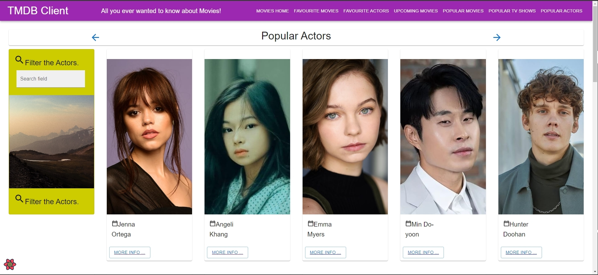

# Web App Dev 2 - Assignment 1 - ReactJS app.

Name: [Eric Butler]

## Overview.

### New Pages.

[ Provide a bullet-point list of the new pages you added to the Movies Fan add (include modifications to existing pages).]

+ List of Popular Movies (Shows page 2 as it's similar list to "Discover Actors")
+ List of Popular TV Shows
+ Popular Actors
+ Actor bio
+ Favourite Actors (page works but not usable due to like button not showing on popular actor's page)
+ (Modified) Site Header - Changed "Home" to "Movies Home"

### New Features.

[ Provide a bullet-point list of the __new features__ you added to the Movies Fan app.] 
+ UI - New Views / pages (3+)
+ List View (Popular Movies, Popular Actors, Popular TV shows)
+ Routing - New Routes
+ At least one additional parameterized URL - Actor Bio
+ Another data entity type: added both Actor and TV series data entity types
+ Extensive data hyperlinking (More info button on popular movies links to actor bio page )
+ Data model - Full Caching support
+ Favourite Actors - Attempted
+ Storybook support - Attempted

## Setup requirements.

[ Outline any non-standard setup steps necessary to run your app locally after cloning the repo.]

## TMDB endpoints.

[ List the __additional__ TMDB endpoints used, giving the description and pathname for each one.] 

+ /movies/{movie_id}/popular - A list of popular movies
+ /discover/tv? - A list of tv. 
+ genre/tv/list? - Genres for tv shows. 
+ /tv/{tv_id}/images? TV Images.
+ /discover/tv? Popular TV shows.
+ /person/popular - A list of popular actors.
+ /person/${id} - Get Actor.
+ /person/popular - Get Actors.
+ /person/{person_id} - Get Actor .

## App Design.

### Component catalogue.

[ Insert a screenshot from the Storybook UI, and highlight the stories that relate to your __new/modified components__ - see the example screenshot below.] .......

### UI Design.

[ Insert screenshots of the __new app pages__ you developed (including modified existing pages), Have an appropriate caption for each one (see example below).

>Shows detailed information on popular movies. Clicking the 'Heart' adds movie to favourite.

>Shows detailed information on popular movies. Static page as "More Info" doesn't function

>Shows detailed information on popular actors. Clicking the "More info" button will take you to a page to see details about the actor.

>Shows detailed information on the actor such as birthday, know for, and where they were born.

### Routing.

[ List the __new routes__ supported by your app and state the associated page.]

+ /actors/:id - shows details about a particular actor.
+ /movies/popularMovies - displays a list of popular movies.
+ /tv/popularShows - displays a list of popular tv shows.
+ /actor/popularActors - displays a list of popular actors.
+ /actor/favourites - displays a list of favourite actors.
+ /actor/latestActors - displays a list of latest actor.

[If relevant, state what aspects of your app are protected/private (i.e. require authentication) and what is public.]

N/A

## Independent learning (If relevant).

N/A
